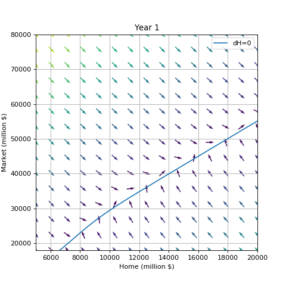
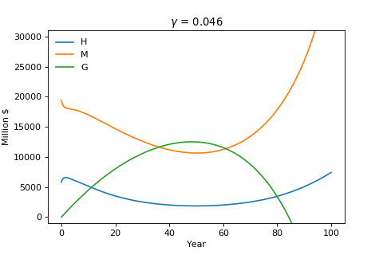
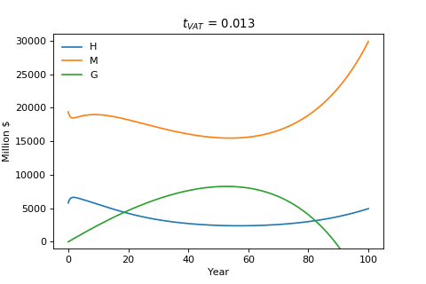

### Universal Basic Income

Default parameters: [params.py](params.py)

___
#### Phase diagram
See [animation_100_years.ipynb](animation_100_years.ipynb)

    

___
#### Sensitivity to Gamma
See [animation_gamma.ipynb](animation_gamma.ipynb)

    

___
#### Sensitivity to VAT
See [animation_vat.ipynb](animation_vat.ipynb)

    

